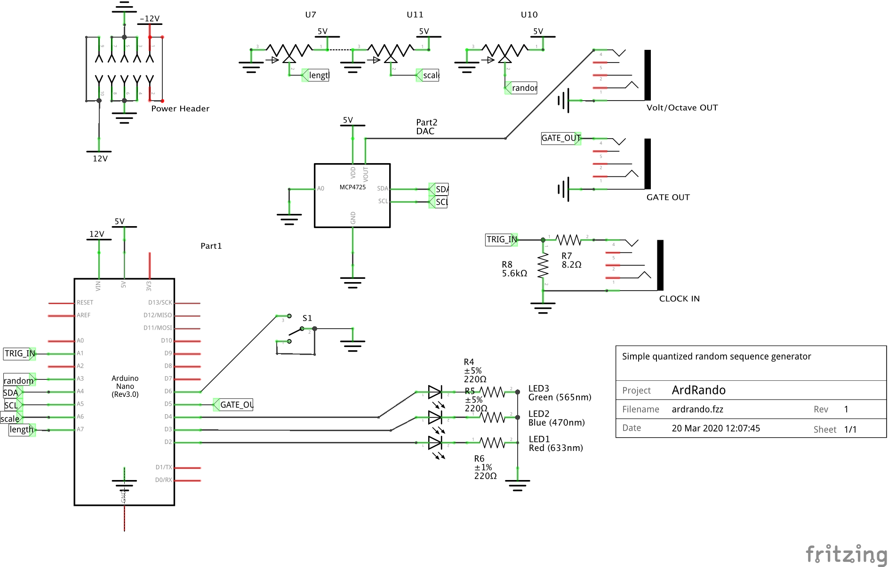

# Ardrando: Simple Arduino Turing-style Quantized Random Sequence Generator

## Parts
### Electrical Components
- Arduino Nano
- MCP4725
- Optional:  Power filtering caps
- 3x 100k pots
- 3x 3mm LEDs
- 1x toggle switch
- 1x momentary button
- 3x 3.5mm mono jacks
- Resistors
  -  1x 8.2K
  -  1x 5.6K
  -  3x 220R

### Panel
3D printed panel from Chris Spitale
- https://www.thingiverse.com/thing:3564365

## Usage

When the toggle is up, it uses an internal clock. When toggle is down, `CLOCKIN` waits for trigger to emit notes. `v/O` outputs quantized notes CV 0-5V. `GATE` outputs 5V gate signal.

### Normal

- Knob 1: _random_.  Full clockwise locks the sequence, full counter-clockwise randomizes the sequence.
- Knob 2: _scale_. Clockwise narrows the range of the sequence, counter-clockwise widens it.
- Knob 3: _sequence length_. Set sequence length 1 - 16.

### When Shift button is pressed

#### Held for 2 seconds
- Knob 1: Set quantization scale 1-8: 1=octaves, 2=octaves and fifths, 3=major, 4=minor, 5=relminor, 6=7th, (default)=all semitones)
- Knob 2: Change BPM (internal mode only)
- Knob 3: Change note length

#### Held for 4 seconds
Sequence is reset

#### Held for 8 seconds
Arduino is reset

## Schematic and Pictures

